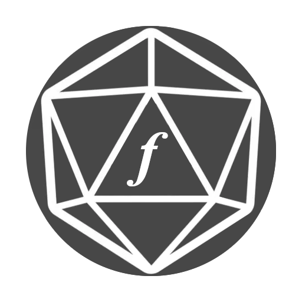
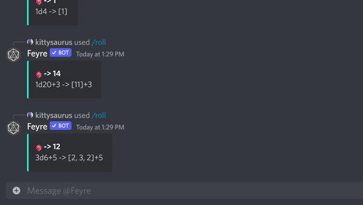
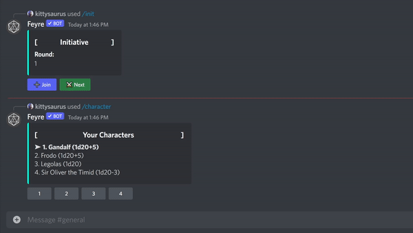

<h2 align="center"></h2>
<h1 align="center" style="font-size:50px; font-family:'Times New Roman'"><i>feyre</i></h1>

 
<h5 align="center"></h5>
 

<h5 align="center">
  <a href="https://invite.feyre.io">
    
       
    
    
  </a>
</h5>

  
  
  
  

# **Overview 🎲**

A streamlined and intuitive Discord bot for playing D&D and other role-playing games.

---
## **Documentation 📚**

For extended documentation on using this bot see [feyre.io](https://feyre.io/commands)

---

## **Features**
## Advanced Dice Rolling 🎲

#### Use *dice expressions* to roll for any scenario
* A die can be represented as [number]d[size]
* An expression is any combination of dice, modifiers, and arithmetic!

#### Roll the same *dice expression* multiple times with the *count* modifier
* Ex: 1d6+3c3 = roll 1 six-sided die and add 3, 3 times independently

#### Use *then* for conditional dice rolls, like checking against AC
* Ex: 1d20+5>15t2d6+4 = roll 1 twenty-sided die and add 5, if that is greater than 15, roll two six-sided die and add 4

#### Use *keep*, *keep-lowest* *explode*, and *explode on* for special rolls, like rolling with advantage!
* Ex: 2d20k1 = roll two twenty-sided die, keep the highest one

   
  

## Initiative Tracking ⚔️

#### Easily keep track of turns and join using your active character
#### Manage up to 10 characters with /character
#### Never forget your initiative, the tracker is saved for you

   
  

