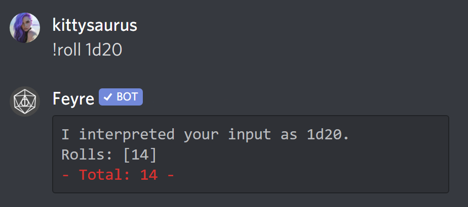

# Feyre 🎲

A streamlined and intuitive Discord bot for playing D&D and other role-playing games.

Feyre is an easy to use discord bot that helps you and your friends play Dungeons and Dragons or other role-playing games in discord. It is designed to be as unintrusive as possible so that you can focus on the game.

## Top Features ⭐

See the *Features* section below for full details. Here are some of the top features you can use with Feyre:

* 🎲 Dice Rolling
* 📍 Initiative Tracker
* 🃏 Draw from the *Deck of Many Things*
* 💰 Character Wallets and Bank Tracking
* 🔎 Quick Lookup: Feats, Conditions, Spells, Monsters, Items, and more

<!-- markdownlint-disable no-inline-html -->

  

<!-- markdownlint-enable no-inline-html -->

## Documentation 📚

For extended documentation on using this bot: [docs](https://feyre.readthedocs.io/en/latest/#)

## Features 🗺️

Additional feature information, usage, and demos. (check out the [docs](https://feyre.readthedocs.io/en/latest/#) for even more)

### Robust & Fast Dice Rolling 🎲

Roll dice of any size with built in advantage and skill checks. As long as your expression is valid, Feyre can roll any set of dice! Quickly re-roll your previous rolls by using the re-roll button.

Keep your rolls between you and the gamemaster using the gm command!

### Initiative Tracker 📍

Combat should be about strategy, suspense, and having fun. Not about keeping track of turn order! With Feyre players can add themselves to initiative with only a click a button.

### Draw from the Deck of Many Things 🃏

Just..one...more....card.....

### Manage Your Character's Wallets 💰

Need to keep track of your character's money? Use Feyre's bank feature to keep a tight hold on your purse strings!

What about dividing money up among the party? The currency command supports currency conversion and division.

### Quickly Lookup Feats, Conditions, Spells, Monsters, Items, and more 🔎

Forgot what it means to be Prone? How about how much HP Cure Wounds can heal? Feyre lets you quickly lookup feats, conditions, spells, monsters, items, weapons, classes, and class abilities!

### See Feyre's [documentation](https://feyre.readthedocs.io/en/latest/#) for a list of all supported commands and features

## Building with Docker 🐳

This section is for dev purposes

To build Feyre for development simply run the following command:

`make run`

This will build Feyre with `Docker` and `Docker-compose`.

Note: You will need to be provided credentials for building.
